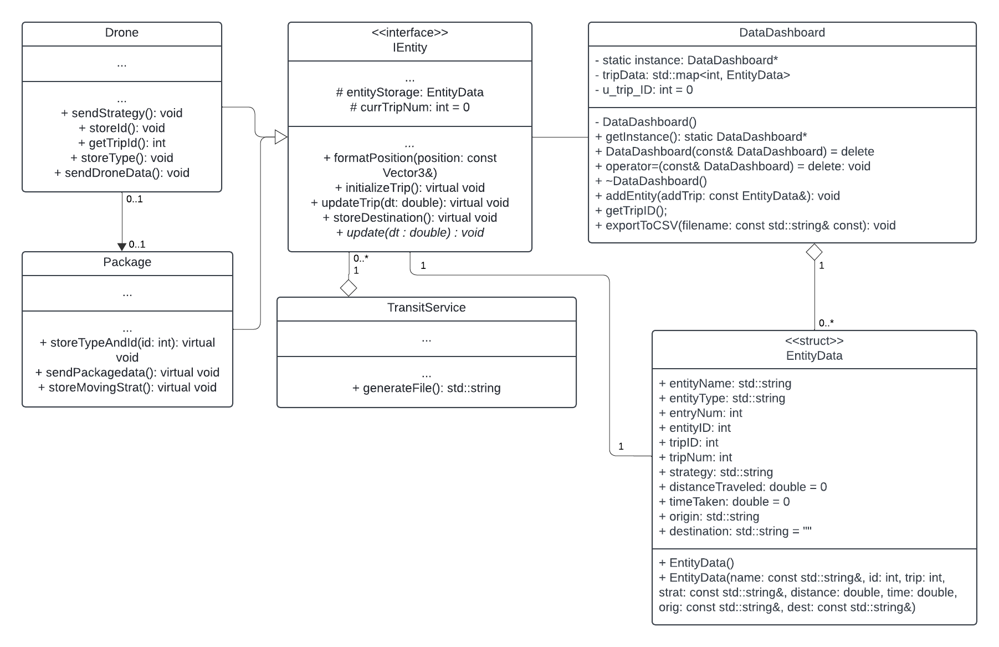
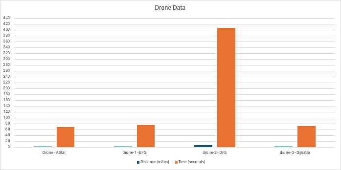
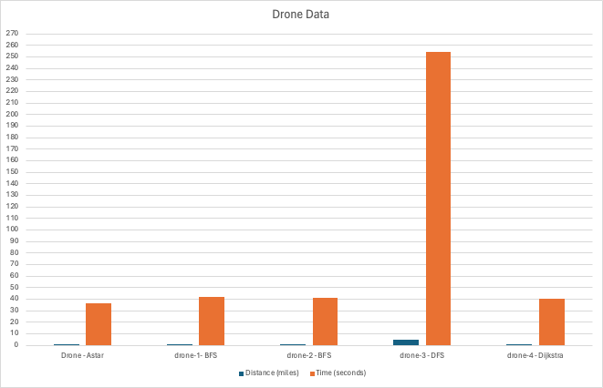

## Project Overview

This project is a simulation that represents the behavior of several entities such as
a helicopter, humans, drones, robots, and packages. Users are able to schedule packages
for pickup and delivery via drone, using a variety of movement strategies.
Additionally, there is a helicopter that is always
in motion, and users can also spawn humans to interact with the simulation.
For our extension, we have created a Data Dashboard that outputs data focused on the 
speed, movement, and location of the drone and package entities in order to determine the most 
efficient deliveries from a business perspective.

## Running the Simulation

There are three ways to run this project. You can choose to run it through a CSE lab machine, your personal computer, or via Docker image.
    
    To run the simulation on your personal machine:
    1. Use Git to clone the repository
    2. Open a Terminal window
    3. Go to the project directory -> cd /path/to/repo/project
    4. Compile the project -> make -j
    5. Run the project ->   ./build/bin/transit_service 8081 web/dist/
    6. Access the simulation at this URL: http://127.0.0.1:8081

    To run the simulation on a CSE lab machine:
    1. SSH into a CSE Lab Machine and use port forwarding -> ssh -L 8081:127.0.0.1:8081 x500@csel-xxxx.cselabs.umn.edu
    2. Follow the rest of the steps from the personal machine set up

    Run the simulation via Docker:
    1. Docker login and enter credentials
    2. cd to the working project folder
    3. Build the project -> docker build -t jacobocious/final_sim .
    4. Wait for the project to build
    5. Run the project -> docker run --rm -it -p 8081:8081 jacobocious/final_sim
[Docker link](https://hub.docker.com/repository/docker/jacobocious/final_sim/general)

## Simulation Overview

The main functionality of this simulation is the drone delivery service, where packages can be scheduled for pick-up and delivery. Whenever a delivery trip is scheduled, the drone heads to it's pickup location for the package, grabs the package, then heads to it's delivery location where a robot is waiting for the package. Upon successful completion of the delivery, the drone does a celebratory movement according to whichever movement strategy it used to complete the delivery. When the delivery is scheduled, users are able to give the drone a name and choose from 4 movement strategies for the drone to use. The movement strategies are: AStar, Breadth-first Search (BFS), Depth-first Search (DFS), and Dijkstra. As each movement strategy utilizes different logic to complete the delivery, using different strategies for identical pick-up and drop off locations can cause drastically different delivery times and trip lengths. Users are also able to add multiple drones and humans to the simulation in addition to the singular drone, human, and helicopter that are spawned upon simulation start. Humans within the simulation travel towards random destinations, as well as the Helicopter within the sky.

## New Feature

Our new feature is a data dashboard (DataDashboard class) that captures and outputs the Entity Name, Entity Type, Entry Number, Entity ID, Unique Trip ID number, Trip Number(Entity specific), Path Strategy used, Distance (in miles), Time (in seconds), Origin location, and Destination location. It uses the IEntity class so that new entity data can be collected if new entities are added (delivery trucks, delivery helicopters, etc.).

This extension is interesting because it demonstrates the efficiency of different movement patterns. Companies are always interested in ways to optimize time and profit and the data collected from the simulation will be helpful in that endeavor. By collecting and analyzing this data, companies will be able to figure out which movement strategies are best for their company, and which locations have more pick-ups and drop offs in order to allocate resources efficiently.

The Data Dashboard adds to the existing code base by utilizing previous code to gather and analyze entity information. We utilized existing functions and object information to gather the information in a useful and non-redundant manner. We used the Singleton design pattern to make sure there is only one instance to ensure global access and consistency in the data. The user can export the current trip/entity information at any time, and the total information will be automatically exported at the end either way.

    Using the Data Dashboard:

    1. Access the simulation
    2. Schedule some deliveries, make sure there are enough deliveries to produce useful information
    3. Click the Export Data button or simply Stop the simulation
    4. Open the sim_data_[#].csv/sim_data_final.csv file

## UML Diagram

## Sprint Retrospective

What went well: The sprint overall went well. We worked well together as a team and had equal levels of motivation and desired grade outcome. Most of the work for the project was done in person to allow for greater collaboration and ease of communication. We were able to stick to our timelines and complete our responsibilities without much stress.

What went poorly: We had trouble agreeing on the entity data container used by the DataDashboard but that was our only issue. We started coding before throughly discussing it so we had some disagreements. 

What could change: For future projects we will spend more time brainstorming a variety of potential strategies and discuss all the details before beginning the implementation in order to work together more efficiently and choose the best options.

## Analysis

From a business perspective, important information to collect is the pathing strategy used by the drone, the time it took the drone to start and finish delivery, the total distance traveled, the drone's starting position, and the delivery destination. This information is important because drones should be stationed near areas with frequent deliveries, and subsequent resources should be allocated to areas with high demand. The pathing strategy used by the drone, along with distance traveled and time taken, will allow companies to constantly optimize their strategies, as this data collection supports the addition and modification of new strategies. Included also are the entities' names, IDs, unique trip ID, and specific trip number for a given delivery entity. This information is useful in identifying which entity belongs to which trip, and also allows the observation of each unique trip. Below we will take a look at the results regarding the difference in delivery performance between the different pathing strategies.

### Simulation 1

In this simulation, four drones that all started at the same position each delivered a package from approximately the same starting point to approximately the same ending point, each using a different pathing strategy. The distance spanned from the East to West Bank in the simulation. While Drone, drone-1, and drone-3, using AStar, BFS, and Dijksta respectively, traveled around 1.3 miles and took from around 68 to 76 seconds to start and complete the delivery, drone-2, using DFS, traveled 7.5 miles and took over 406 seconds.

### Simulation 2

In this simulation, five drones that all started at the same position also each delivered a package from approximately the same starting point to approximately the same ending point, each using a different pathing strategy. The distance was confined to the East Bank in the simulation. While Drone, drone-1, drone-2, and drone-3, using AStar, BFS, BFS, and Dijksta respectively, traveled around 0.7 miles and took from around 36 to 42 seconds to start and complete the delivery, drone-3, using DFS, traveled 4.7 miles and took over 254 seconds.

For detailed data, please see test_data/sim_data_shorter.csv and test_data/sim_data_longer.csv

### Conclusion

From the data we've collected, we can see slight differences in performance between the AStar, BFS, and Djikstra strategies, but a significant difference using the DFS pathing strategy. This same analysis can be done on new pathing strategies as they are added to provide insight into the optimal pathing strategy to use.
